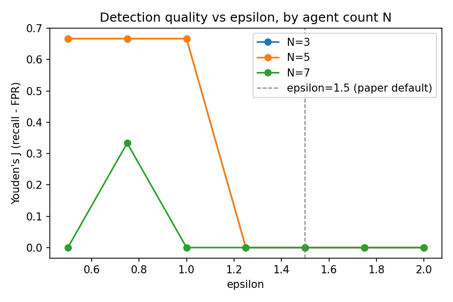
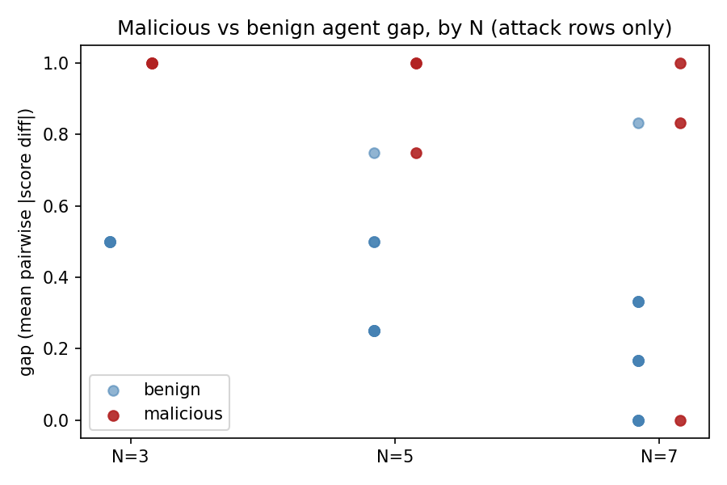

# Epsilon Scaling 파일럿 결과 (목표 1)

- 실행 날짜: 2026-08-22
- 모델: gpt-4o-mini
- 총 LLM 호출: 4,665회 (`get_edge_score` 파싱 재시도 포함, 계획 대비 +232%), 소요 시간 약 74분

## 1. 실험 개요

고정 epsilon=1.5(`mas.bpd.detect_malicious`)가 에이전트 수 N이 늘어나도 유효한지 확인하기 위한 파일럿.

| 항목 | 값 |
|---|---|
| MAS 구조 | flat |
| N 수준 | 3, 5, 7 |
| 질문 수 | N당 6개 (attack 3 + no-attack 3) |
| malicious_agent_id | attack: 1 고정 / no-attack: 없음 |
| epsilon 스윕 | 0.5, 0.75, 1.0, 1.25, 1.5, 1.75, 2.0 (사후 재계산, LLM 재호출 없음) |

## 2. N별 최적 epsilon

테스트한 epsilon 그리드({0.5, 0.75, 1.0, 1.25, 1.5, 1.75, 2.0}) 내에서 Youden's J를 최대화하는 값.

| N | best_epsilon | recall | fpr | youden_j |
|---|---|---|---|---|
| 3 | 0.50 | 1.000 | 0.333 | 0.667 |
| 5 | 0.50 | 1.000 | 0.333 | 0.667 |
| 7 | 0.75 | 0.667 | 0.333 | 0.333 |

**epsilon=1.5(논문 기본값)에서는 N=3/5/7 모두 recall=0** — 이 파일럿 설정(gpt-4o-mini, flat)에서는 논문 기본 임계값이 공격자를 단 한 번도 탐지하지 못했다. 전체 스윕 결과는 [epsilon_pilot_summary.csv](epsilon_pilot_summary.csv) 참고.

## 3. epsilon별 Youden's J (N별 비교)

- N=3과 N=5 곡선은 완전히 겹친다(둘 다 epsilon 0.5–1.0 구간에서 J=0.667, 이후 급락) — 그래프 상 파란 N=3 선이 주황 N=5 선에 가려 안 보임.
- N=7은 정점 자체가 낮아지고(J=0.333, N=3/5의 절반) 정점 위치도 왼쪽(0.75)으로 이동.
- 세 곡선 모두 epsilon=1.5(점선) 근처에서는 이미 J=0에 도달해 있다 — "최적 epsilon이 N에 따라 이동하는가"라는 질문 이전에, 애초에 1.5가 이 세팅에서 작동 구간 자체를 벗어나 있다.

## 4. malicious vs benign agent gap 분포

- **N=3**: malicious gap이 항상 1.0, benign gap이 항상 0.5로 완벽히 분리(문항 3개 모두 동일값 → 점이 겹쳐 하나로 보임). 다만 이 "완벽한 분리"는 표본이 3문항뿐이라 우연일 가능성이 크다.
- **N=5**: benign이 0.25–0.75, malicious가 0.75–1.0으로 넓어지기 시작하고 0.75 지점에서 두 그룹이 겹친다.
- **N=7**: benign이 0–0.83, malicious가 0–1.0까지 거의 전 구간에 걸쳐 퍼져 있고 겹침이 가장 크다 — malicious 중 하나는 gap이 0으로, 완전히 benign처럼 보인다.
- 즉 N이 늘어날수록 malicious의 신호가 약해진다기보다, **benign 에이전트끼리의 우연한 불일치(gap)가 커지면서 분포가 넓어지고 malicious와 겹치는 영역이 늘어난다** — 그래프 3의 J 하락과 정확히 부합하는 그림이다.

## 5. 해석

**epsilon=1.5는 이 세팅에서 처음부터 작동하지 않았다.** N=3/5/7 전부 epsilon=1.5에서 recall=0이었다 — "N이 커지면 1.5가 무너지는가"를 보기 전에, 애초에 1.5가 모든 N에서 이미 무너져 있었다. 실제로 감지가 되는 epsilon 구간은 0.5–1.0 정도로, 논문 기본값의 1/3–2/3 수준이었다.

**최적 epsilon은 N이 커질수록 이동은 하지만, 사전 가설(H1)이 예상한 "다중비교로 인한 상향 조정 필요"와는 반대 방향이다.** N=3→5에서는 최적값이 그대로(0.5)였고, N=7에서는 오히려 0.75로 아주 소폭 오른 정도지만, 더 중요한 변화는 임계값의 위치가 아니라 **그 임계값에서 얻을 수 있는 최대 탐지 성능 자체가 낮아졌다는 것**이다(J: 0.667 → 0.667 → 0.333). gap 분포(4번 그래프)를 보면 원인이 뚜렷하다 — N이 늘어날수록 malicious 신호가 약해지는 게 아니라 **benign 에이전트 사이의 우연한 불일치가 커지면서 malicious와 겹치는 영역이 넓어진다.** 이는 애초 가설에서 언급한 다중비교 효과(N-1개 중 최댓값을 고르는 구조상 benign이 우연히 threshold를 넘을 확률이 커짐)와 방향은 같지만, "epsilon을 더 크게 잡으면 해결된다"는 결론으로 이어지지 않는다 — N=7에서는 어떤 epsilon을 잡아도 N=3/5만큼의 성능이 안 나온다(최댓값 자체가 낮음).

**결론적으로 이 파일럿의 신호는 "epsilon을 N에 비례해서 올리자"보다는 "epsilon=1.5 자체가 너무 높고, N이 커질수록 고정 임계값 하나로는 recall과 FPR을 동시에 만족시키기 어려워진다"에 가깝다.** 다만 아래 한계 때문에 이 결론은 잠정적이다.

## 6. 한계

- N당 문항 6개(attack 3 + no-attack 3)로 표본이 매우 작아 통계적 유의성을 주장하기 어려움. recall/fpr이 0, 0.333, 0.667, 1.0 네 값만 가능한 수준. N=3의 "완벽한 분리"도 표본이 작아 우연일 가능성을 배제 못함.
- **모델이 논문 기준(gpt-4o/deepseek-chat 등)과 다른 gpt-4o-mini** — epsilon=1.5가 애초에 다른 모델을 기준으로 캘리브레이션된 값일 수 있고, mini 모델이 `[score] x` 형식을 잘 안 지켜 `get_edge_score` 재시도가 계획 대비 3.3배(4,665/1,404) 발생한 것도 판단력 자체가 기준 모델과 다를 가능성을 시사함.
- 페르소나는 5개를 순환 재사용 — persona 반복 자체가 혼입변수가 될 가능성 있음.
- flat 구조만 테스트 — hierarchy 구조에서는 다른 양상일 수 있음.
- malicious_agent_id를 1로 고정 — 특정 persona 위치에 대한 결과일 수 있음.

## 7. 다음 단계

신호가 뚜렷했으므로("epsilon=1.5가 전 구간에서 recall=0", "N=7에서 최대 성능 자체가 하락") 본실험으로 확장할 가치가 있다고 판단됨. 우선순위 제안:

1. **모델을 논문 기준(gpt-4o 또는 deepseek-chat)으로 맞춰서 재검증** — epsilon=1.5의 실패가 gpt-4o-mini 고유의 특성(판단이 더 극단값(±1)에 잘 도달 못함)인지, 구조 자체의 문제인지부터 분리해야 함.
2. 문항 수를 6→15–20개로 늘려 recall/fpr을 더 세밀한 값으로 관측 (현재는 0/0.33/0.67/1.0 4단계뿐).
3. N=7 이후(예: 10, 15)까지 확장해 "최대 성능 하락" 추세가 계속되는지 확인 — 이번 파일럿은 N=7까지만 봤음.
4. malicious_agent_id를 여러 값으로 순환시켜 persona 위치 혼입 통제.
5. 목표 2(초반 기여도 분포 기반 동적 epsilon 산출)로 넘어가기 전에, 우선 "고정 epsilon 자체의 적정 범위(0.5–1.0)"부터 논문 기본값(1.5)과 왜 이렇게 다른지 원인 규명이 선행되어야 함 — 원인이 모델 차이라면 목표 2보다 "모델별 epsilon 재캘리브레이션"이 더 시급한 문제일 수 있음.
